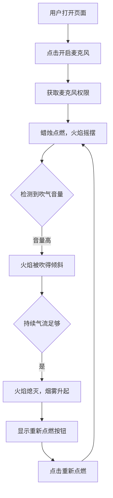

# 生日吹蜡烛 - 产品需求文档

## 1. 产品概述

生日吹蜡烛是一款轻量级网页互动体验。用户开启麦克风后，对着设备吹气，页面中的生日蜡烛火焰会随风摆动、摇曳，最终被吹灭并升起一缕青烟。

- **核心目的**：把现实里的"吹蜡烛"动作映射到屏幕上，营造惊喜、庆祝的互动仪式感。
- **目标用户**：任何想体验趣味生日祝福、测试麦克风互动的用户。
- **产品形态**：单个 HTML 文件，无需安装，打开即用。

## 2. 核心功能

### 2.1 页面结构

| 页面名称 | 模块名称 | 功能描述 |
|---------|---------|---------|
| 主页面 | 引导层 | 提示用户点击按钮开启麦克风权限，说明吹气即可吹灭蜡烛 |
| 主页面 | 蜡烛场景 | 手绘风格的生日蛋糕与蜡烛，火焰使用 CSS/SVG 动画持续闪烁 |
| 主页面 | 吹气检测 | 实时分析麦克风音量，超过阈值后让火焰产生被风吹动的形变 |
| 主页面 | 熄灭状态 | 火焰消失，显示上升烟雾与"生日快乐"文字，提供重新点燃按钮 |

### 2.2 功能模块

1. **麦克风权限获取**：用户主动点击后开始采集音频，保护隐私。
2. **实时音量检测**：通过 Web Audio API 计算输入音量强度。
3. **火焰动画**：火焰持续轻微摇摆；检测到强气流时大幅倾斜、闪烁加剧。
4. **熄灭判定**：持续强气流超过阈值和时间后，火焰渐变消失。
5. **重新点燃**：提供按钮让场景重置，蜡烛重新燃起。

## 3. 核心流程

用户打开页面 → 点击"开启麦克风"按钮 → 授权后蜡烛点燃 → 用户吹气 → 音量检测触发火焰倾斜/闪烁 → 气流足够强时火焰熄灭、出现烟雾与祝福语 → 用户可点击"再点一次"重新庆祝。

## 4. 用户界面设计

### 4.1 设计风格

- **整体氛围**：温暖、庆祝、沉浸感，使用深色背景衬托烛光。
- **主色调**：深紫/深灰背景 `#1a1221`，烛光暖色 `#ff9d00` / `#ff5e00`，蛋糕奶油色 `#fff8e7`，烟雾灰白 `#e0e0e0`。
- **字体**：标题使用圆润手写风格字体（如 `Pacifico` 或类似 Google Fonts 手写体），正文使用无衬线字体保持可读性。
- **按钮**：圆角胶囊按钮，带微光 hover 效果。
- **动效**：火焰使用 CSS 关键帧持续摇摆；吹气时使用 transform skew/scale 制造倾斜；熄灭时使用 opacity + scale 淡出。

### 4.2 页面元素

| 页面名称 | 模块名称 | UI 元素 |
|---------|---------|---------|
| 主页面 | 引导层 | 标题、说明文字、开启麦克风按钮 |
| 主页面 | 蛋糕与蜡烛 | 蛋糕底座、奶油层、蜡烛主体、火焰 |
| 主页面 | 状态反馈 | 实时音量条、吹气提示文字 |
| 主页面 | 结束状态 | 烟雾粒子、"生日快乐"标题、重新点燃按钮 |

### 4.3 响应式设计

- **桌面优先**：页面居中，蜡烛大小适中。
- **移动端适配**：限制最大宽度，触控区域加大，音量提示避免遮挡主要内容。

## 5. 非功能性需求

- **性能**：动画优先使用 CSS transform 和 opacity，保证 60fps。
- **隐私**：仅在用户点击后请求麦克风，不保存或上传任何音频数据。
- **兼容性**：支持现代浏览器（Chrome、Edge、Safari、Firefox）。
- **降级方案**：如果用户拒绝麦克风权限或浏览器不支持，显示"请大声喊或点击吹灭"的替代按钮。
