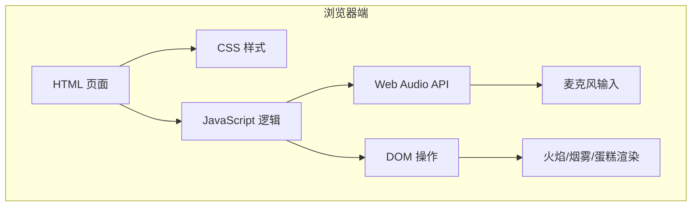

# 生日吹蜡烛 - 技术架构文档

## 1. 架构设计

本项目为纯前端单页应用，无后端服务。所有交互逻辑、音频采集与视觉渲染均在浏览器端完成。

## 2. 技术选型

- **前端**：原生 HTML5 + CSS3 + JavaScript（ES2020+）
- **构建工具**：无，单个 HTML 文件直接运行
- **第三方依赖**：Google Fonts 字体（手写体 + 无衬线体）
- **音频输入**：Web Audio API（`AudioContext`、`AnalyserNode`、`getUserMedia`）
- **动画**：CSS `@keyframes` + JavaScript `requestAnimationFrame`
- **后端**：无
- **数据存储**：无

## 3. 页面/路由定义

| 路由/文件 | 用途 |
|----------|------|
| `/index.html` | 唯一页面，包含全部 HTML 结构、CSS 样式与 JavaScript 逻辑 |

## 4. 核心模块说明

### 4.1 音频检测模块

- 使用 `navigator.mediaDevices.getUserMedia({ audio: true })` 获取麦克风权限。
- 创建 `AudioContext` 与 `AnalyserNode`，通过 `getByteFrequencyData` 或 `getByteTimeDomainData` 实时计算音量 RMS。
- 以 `requestAnimationFrame` 循环读取音量，映射到火焰倾斜角度与闪烁强度。

### 4.2 火焰渲染模块

- 火焰由多层 `div` + 圆角 + 径向渐变构成，外层光晕使用 `box-shadow`。
- 正常状态：CSS 关键帧控制轻微摇摆、亮度脉动。
- 吹气状态：根据音量动态设置 `transform: skewX(...)` 和 `scale(...)`，模拟被风吹斜。

### 4.3 熄灭与重置模块

- 当音量持续高于阈值并累计到一定时间，触发熄灭流程。
- 熄灭时：火焰透明度/缩放渐变为 0，生成烟雾粒子并向上飘散。
- 显示"生日快乐"文字与"再点一次"按钮，点击后重置状态重新点燃。

## 5. 性能与兼容性

- **性能**：动画仅使用 `transform` 和 `opacity`，避免触发重排。
- **兼容性**：要求浏览器支持 `getUserMedia` 与 `AudioContext`，主流现代浏览器均可满足。
- **降级**：用户拒绝麦克风或环境不支持时，提供手动点击按钮触发吹灭。
